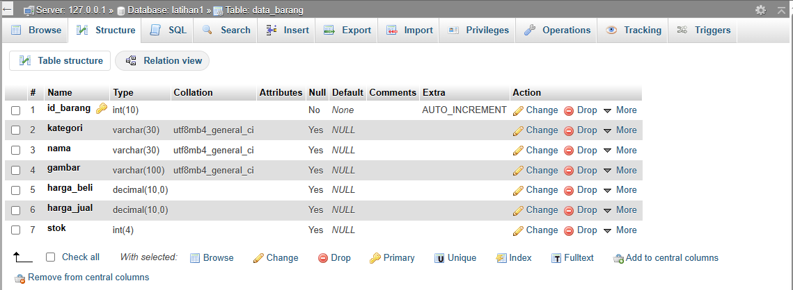

# Tugas lab3_php_database

## Membuat program CRUD dengan bahasa PHP 

* buat semua file yang di butuhkan untuk membuat progran berdasarkan module dan diaplikasikan

Hasilnya 

* terkoneksi kedalam database MYSQL

* Halaman Home untuk mengatur atau melihat keseluruhan barang yang ada dalam Data Barang

*  Halaman tambah barang untuk menambahkan barang kedalam Data Barang 

* Tombol Hapus untuk menghapus barang yang ada dalam data Barang

* Tombol Edit yang digunakan untuk mengedit dari sebuah produk yang ketika di klik tombil edit maka akan diarahkan kehalaman ubah/edit

